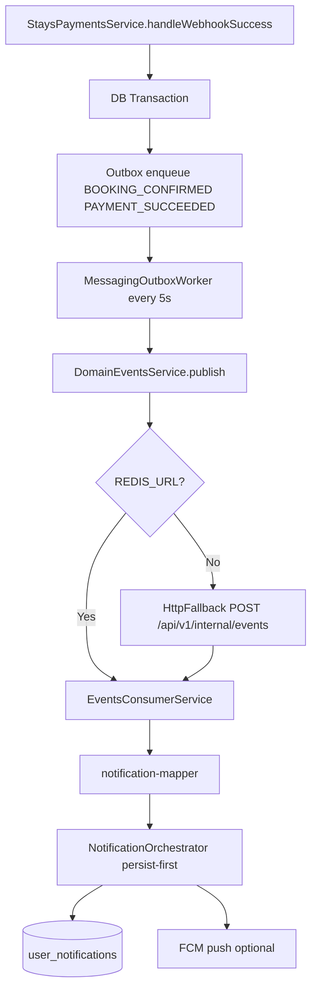
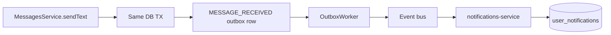
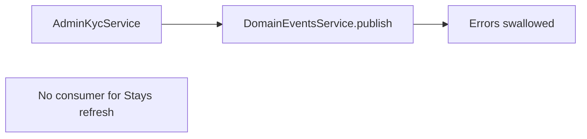

# Event Flow Diagrams

## Payment confirmed → notifications

**Verify:** Publisher ✅ | Consumer ✅ | Retry outbox ✅ | Idempotency ⚠️ duplicate webhook | Logging ✅ | Metrics partial

## Message sent → notification

**Verify:** Outbox in same TX as message ✅ | MUTE level not enforced ⚠️

## Identity KYC updated (gap)

**Risk:** Stays snapshot stale until TTL — MEDIUM
